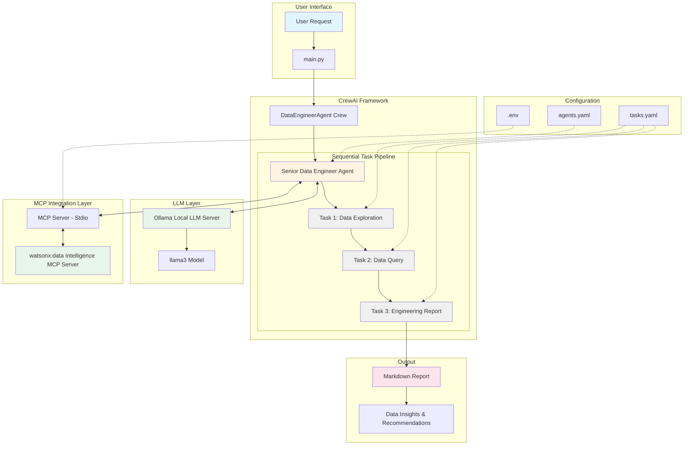

# DataEngineerAgent Crew

Welcome to the DataEngineerAgent Crew project, powered by [crewAI](https://crewai.com). This template is designed to help you set up a multi-agent AI system with ease, leveraging the powerful and flexible framework provided by crewAI. Our goal is to enable your agents to collaborate effectively on complex tasks, maximizing their collective intelligence and capabilities.

## Architecture



### Architecture Components

**User Interface Layer:**
- Entry point through `main.py` with customizable input parameters
- Supports multiple execution modes: run, train, replay, test, and trigger-based

**CrewAI Framework:**
- **DataEngineerAgent Crew**: Orchestrates the multi-agent workflow
- **Senior Data Engineer Agent**: AI agent with expertise in data engineering, SQL, ETL/ELT, and data architecture
- **Sequential Process**: Tasks execute in order with context passing between stages

**Task Pipeline:**
1. **Data Exploration Task**: Discovers catalogs, schemas, tables, and metadata
2. **Data Query Task**: Constructs and executes optimized SQL queries
3. **Engineering Report Task**: Synthesizes findings into actionable insights

**LLM Layer:**
- **Ollama Local LLM Server**: Local inference server running at `http://localhost:11434`
- **llama3 Model**: Open-source language model for agent reasoning and decision-making

**MCP Integration:**
- **MCP Server (Stdio)**: Model Context Protocol server for agent-to-data communication
- **watsonx.data Intelligence MCP Server**: Specialized server providing data intelligence capabilities
- Enables real-time data exploration, querying, and metadata retrieval from IBM watsonx.data

**Configuration:**
- `agents.yaml`: Defines agent roles, goals, and backstories
- `tasks.yaml`: Specifies task descriptions, expected outputs, and dependencies
- `.env`: Stores environment variables and API credentials

**Output:**
- Markdown-formatted reports with data insights, quality observations, and recommendations

## Installation

Ensure you have Python >=3.10 <3.14 installed on your system. This project uses [UV](https://docs.astral.sh/uv/) for dependency management and package handling, offering a seamless setup and execution experience.

First, if you haven't already, install uv:

```bash
pip install uv
```

Next, navigate to your project directory and install the dependencies:

(Optional) Lock the dependencies and install them by using the CLI command:
```bash
crewai install
```
### Customizing

**Add your `OPENAI_API_KEY` into the `.env` file**

- Modify `src/data_engineer_agent/config/agents.yaml` to define your agents
- Modify `src/data_engineer_agent/config/tasks.yaml` to define your tasks
- Modify `src/data_engineer_agent/crew.py` to add your own logic, tools and specific args
- Modify `src/data_engineer_agent/main.py` to add custom inputs for your agents and tasks

## Running the Project

To kickstart your crew of AI agents and begin task execution, run this from the root folder of your project:

```bash
$ crewai run
```

This command initializes the data-engineer-agent Crew, assembling the agents and assigning them tasks as defined in your configuration.

This example, unmodified, will run the create a `report.md` file with the output of a research on LLMs in the root folder.

## Understanding Your Crew

The data-engineer-agent Crew is composed of multiple AI agents, each with unique roles, goals, and tools. These agents collaborate on a series of tasks, defined in `config/tasks.yaml`, leveraging their collective skills to achieve complex objectives. The `config/agents.yaml` file outlines the capabilities and configurations of each agent in your crew.

## Support

For support, questions, or feedback regarding the DataEngineerAgent Crew or crewAI.
- Visit our [documentation](https://docs.crewai.com)
- Reach out to us through our [GitHub repository](https://github.com/joaomdmoura/crewai)
- [Join our Discord](https://discord.com/invite/X4JWnZnxPb)
- [Chat with our docs](https://chatg.pt/DWjSBZn)

Let's create wonders together with the power and simplicity of crewAI.
